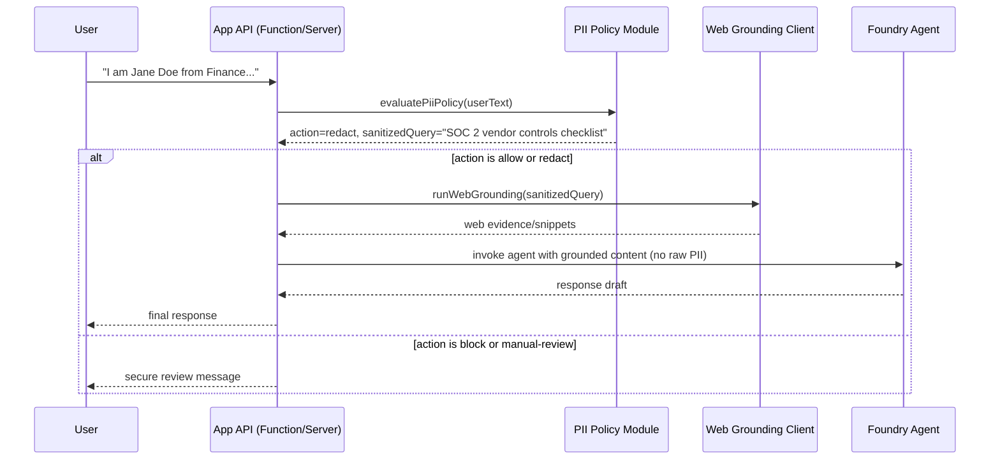

# Hands-On Lab: PII-Safe Web Grounding with the Jane Doe SOC 2 Scenario

**Duration:** 60-90 minutes  
**Difficulty:** Intermediate  
**Audience:** Solution architects, app engineers, security/compliance engineers  
**Scenario:** A user asks: "I am Jane Doe from Finance. What are SOC 2 vendor controls?" and you need to ensure PII does not leave your tenant boundary when using web grounding.

---

## Lab Outcome

By the end of this lab, you will:

1. Separate sensitive user context from web research intent
2. Redact or block PII before any web-grounded request
3. Run a policy-driven decision path (allow, redact, block, manual review)
4. Verify that outbound grounded queries do not contain user identifiers

---

## Architecture (PII-Safe Grounding)

```text
User Message
  |
  v
PII Detection + Policy Gate (Function API)
  |            \
  | allow/redact \ block/review
  v              v
Bing/Web Grounding   Internal Queue / Review
  |
  v
Response Composer (re-injects only safe local context)
  |
  v
User Response + Safe Logging
```

---

## Prerequisites

1. Existing Function-based app similar to your webhook pattern
2. Azure subscription and access to configure AI services
3. VS Code installed
4. Sample test client (Postman, curl, or Teams test harness)
5. Synthetic test data only (no real personal data)

---

## Part 1: Define Policy Rules for the Jane Doe Scenario

### Step 1.1: Create a Minimal PII Policy

Create the following policy behavior in your app:

1. If user text contains name/department/email/phone, do not forward those fields to web grounding
2. Extract only topic intent for web query
3. Block external grounding if policy score is high risk
4. Log only redacted query and policy decision metadata

### Step 1.2: Target Behavior for Example Input

Input:

`I am Jane Doe from Finance. What are SOC 2 vendor controls?`

Expected behavior:

1. PII detected: name and department
2. Outbound grounded query becomes: `SOC 2 vendor controls checklist`
3. Internal logs store:
   - risk level
   - action taken
   - redacted query
4. No raw `Jane Doe` or `Finance` appears in outbound query or logs

---

## Part 2: Implement Query Separation in VS Code

### Step 2.0: Understand Who Calls What and When

Use this sequence as the source of truth for runtime behavior:



Call responsibilities:

1. **Client/UI** sends raw user prompt to your API
2. **API handler** calls `evaluatePiiPolicy(...)` first
3. **Policy module** returns `allow`, `redact`, `block`, or `manual-review`
4. **Grounding client** is called only when action is `allow` or `redact`
5. **Foundry invoke** receives only sanitized/approved research context

### Step 2.0.1: What Is Needed in Foundry UI?

For this code path, the PII separation logic runs in your app (not automatically in Foundry). In Foundry UI, configure guardrails as defense-in-depth:

1. Open https://ai.azure.com and go to your project
2. Open your agent under **Build** -> **Agents**
3. In agent configuration/settings:
  - Enable available safety/guardrail controls
  - Add system instruction such as: "Never include personal identifiers from user prompts in external research queries."
  - Keep tool instructions aligned with your app policy actions
4. Save and re-test

Important:

1. Foundry guardrails do not replace your app-side pre-grounding policy gate
2. Treat app-side policy as the primary control that prevents raw PII from leaving your tenant boundary

### Step 2.0.2: Exactly What to Create vs Update in VS Code

In VS Code, do these file operations explicitly:

1. **Create new file:** `src/server/piiQueryPolicy.ts`
  - This file contains only policy evaluation and topic sanitization logic
2. **Update existing API entry file** (choose your app's entry point):
  - If using Azure Functions: update the HTTP trigger file (for example `onTicketSubmitted.ts`)
  - If using this repo pattern: update request handling in `apps/teams-left-rail/src/server/index.ts`
3. **Optionally update Foundry call wrapper:**
  - If your repo centralizes agent calls in `apps/teams-left-rail/src/server/foundryClient.ts`, ensure it accepts sanitized research query/content and never raw user PII text for grounding

Recommended minimal integration order:

1. Add new policy module file
2. Import policy module in API handler
3. Gate grounding call by policy result
4. Replace outbound grounding input with `sanitizedQuery`
5. Verify logs contain only redacted metadata

### Step 2.1: Add a Sanitization Module

Create a file in your app (example path):

`src/server/piiQueryPolicy.ts`

Add this starter implementation:

```typescript
export type PolicyAction = "allow" | "redact" | "block" | "manual-review";

export interface PiiPolicyResult {
  action: PolicyAction;
  riskLevel: "low" | "medium" | "high";
  detectedEntities: string[];
  sanitizedQuery: string;
}

const EMAIL_REGEX = /[A-Z0-9._%+-]+@[A-Z0-9.-]+\.[A-Z]{2,}/gi;
const PHONE_REGEX = /\+?\d[\d\s().-]{7,}\d/g;

// Simple placeholder patterns for demo. Use enterprise-grade detection in production.
const NAME_HINT_REGEX = /\b(i am|i'm|my name is)\s+[a-z]+\s+[a-z]+/i;
const DEPT_HINT_REGEX = /\b(finance|hr|human resources|legal|sales|engineering|it)\b/i;

function extractTopicIntent(input: string): string {
  // Keep this deterministic and conservative for compliance review.
  const lower = input.toLowerCase();

  if (lower.includes("soc 2") && lower.includes("vendor") && lower.includes("control")) {
    return "SOC 2 vendor controls checklist";
  }

  if (lower.includes("soc 2")) {
    return "SOC 2 controls overview";
  }

  return "vendor risk and compliance controls";
}

export function evaluatePiiPolicy(userText: string): PiiPolicyResult {
  const detectedEntities: string[] = [];

  if (EMAIL_REGEX.test(userText)) detectedEntities.push("email");
  if (PHONE_REGEX.test(userText)) detectedEntities.push("phone");
  if (NAME_HINT_REGEX.test(userText)) detectedEntities.push("person-name");
  if (DEPT_HINT_REGEX.test(userText)) detectedEntities.push("department");

  const detectedCount = detectedEntities.length;

  if (detectedCount >= 3) {
    return {
      action: "manual-review",
      riskLevel: "high",
      detectedEntities,
      sanitizedQuery: ""
    };
  }

  if (detectedCount >= 1) {
    return {
      action: "redact",
      riskLevel: "medium",
      detectedEntities,
      sanitizedQuery: extractTopicIntent(userText)
    };
  }

  return {
    action: "allow",
    riskLevel: "low",
    detectedEntities,
    sanitizedQuery: extractTopicIntent(userText)
  };
}
```

### Step 2.2: Use Policy Before Grounding Call

In your request handler (example: `onTicketSubmitted` or chat endpoint), apply policy before web grounding:

```typescript
import { evaluatePiiPolicy } from "./piiQueryPolicy";

async function handleUserResearchPrompt(userText: string): Promise<string> {
  const policy = evaluatePiiPolicy(userText);

  // Safe audit metadata only (no raw sensitive text)
  console.log("PII policy decision", {
    action: policy.action,
    riskLevel: policy.riskLevel,
    detectedEntities: policy.detectedEntities,
    sanitizedQuery: policy.sanitizedQuery
  });

  if (policy.action === "manual-review" || policy.action === "block") {
    return "Your request needs secure review before external research can proceed.";
  }

  // IMPORTANT: send sanitizedQuery, never userText, to web grounding.
  const groundedContent = await runWebGrounding(policy.sanitizedQuery);

  // Re-introduce context carefully without exposing PII.
  return `Here are SOC 2 vendor control considerations based on public sources:\n\n${groundedContent}`;
}
```

### Step 2.3: Wire Into Existing Files (Concrete Mapping)

If you are implementing inside this repository structure, use this mapping:

1. Create: `apps/teams-left-rail/src/server/piiQueryPolicy.ts`
2. Update: `apps/teams-left-rail/src/server/index.ts`
  - Import `evaluatePiiPolicy`
  - Run policy before any grounding/tool call
3. Update: `apps/teams-left-rail/src/server/foundryClient.ts` (if needed)
  - Ensure request body uses sanitized research query/context
  - Do not pass raw user identity fields to external grounding calls

### Step 2.4: Sanity Check Before Moving to Part 3

Before test execution, confirm:

1. There is exactly one policy gate before grounding
2. No alternative code path calls grounding with raw user text
3. Logs print only policy metadata (`action`, `riskLevel`, `detectedEntities`, `sanitizedQuery`)
4. Block/manual-review path returns without grounding call

---

## Part 3: Run the Jane Doe Test Case

### Step 3.1: Test Input

Submit this exact prompt:

`I am Jane Doe from Finance. What are SOC 2 vendor controls?`

### Step 3.2: Verify System Behavior

Check all of the following:

1. Policy result is `redact` (or stricter by your configuration)
2. Detected entities include `person-name` and `department`
3. Outbound query equals topic-only text, for example:
   - `SOC 2 vendor controls checklist`
4. No raw `Jane Doe` or `Finance` appears in:
   - outbound grounding requests
   - logs
   - telemetry traces

### Step 3.3: Validate Response Quality

Confirm response still addresses user intent:

1. Includes SOC 2 vendor control themes (security, availability, confidentiality)
2. Provides practical checklist-style guidance
3. Does not leak user identity fields

---

## Part 4: Add Optional Enterprise Controls

### Option A: Integrate Azure AI Content Safety

Use Content Safety as the detector source instead of regex-only detection.

Suggested pattern:

1. Run Content Safety detection on inbound prompt
2. Map detections to policy action
3. Generate sanitized query
4. Ground only sanitized query
5. Run optional egress check before returning output

### Option B: Add Foundry Guardrails

Use Foundry safety configuration to:

1. Restrict unsafe generation behavior
2. Add policy reminders in system instructions
3. Enforce output constraints for sensitive content

### Option C: Add Purview Governance

For persisted data:

1. Classify stored records
2. Apply retention and access controls
3. Audit policy outcomes over time

---

## Part 5: Security Acceptance Checklist

Pass this checklist before production:

1. No raw PII in outbound web grounding calls
2. No raw PII in app logs
3. Policy outcomes are deterministic and testable
4. Manual review path exists for high-risk cases
5. Policy version is recorded with each assessment or response record
6. Synthetic tests for name/department/email/phone are automated

---

## Troubleshooting

| Symptom | Likely Cause | Fix |
|---|---|---|
| Name still appears in grounded query | App sends raw input to grounding client | Ensure only `sanitizedQuery` is used |
| False positives block too many requests | Overly broad patterns | Reduce sensitivity or use confidence threshold |
| Good topic extraction fails | Intent extractor too narrow | Add deterministic intent mappings for common topics |
| Logs still contain PII | Raw payload logging enabled | Remove raw logs and log policy metadata only |

---

## Stretch Goal

Implement policy-as-code:

1. Externalize thresholds and actions to config per environment
2. Version policy (`v1`, `v2`, etc.)
3. Add integration tests:
   - input
   - detected entities
   - expected action
   - expected outbound query

---

## Quick Test Matrix

| Input | Expected Action | Expected Outbound Query |
|---|---|---|
| `I am Jane Doe from Finance. What are SOC 2 vendor controls?` | `redact` | `SOC 2 vendor controls checklist` |
| `What are SOC 2 vendor controls?` | `allow` | `SOC 2 vendor controls checklist` |
| `My email is jane@contoso.com and phone is 555-123-4567. SOC 2 help?` | `manual-review` (example policy) | none |

This lab can be run as a standalone exercise or used as a security extension for your existing webhook-driven Foundry implementation.

---

## Appendix C: Copy/Paste Patch Set for This Repository

Use this appendix if you want concrete starter edits for the current repo layout.

### C.1 Create New File: apps/teams-left-rail/src/server/piiQueryPolicy.ts

Create this file and paste:

```typescript
export type PolicyAction = "allow" | "redact" | "block" | "manual-review";

export interface PiiPolicyResult {
  action: PolicyAction;
  riskLevel: "low" | "medium" | "high";
  detectedEntities: string[];
  sanitizedQuery: string;
}

const EMAIL_REGEX = /[A-Z0-9._%+-]+@[A-Z0-9.-]+\.[A-Z]{2,}/gi;
const PHONE_REGEX = /\+?\d[\d\s().-]{7,}\d/g;
const NAME_HINT_REGEX = /\b(i am|i'm|my name is)\s+[a-z]+\s+[a-z]+/i;
const DEPT_HINT_REGEX = /\b(finance|hr|human resources|legal|sales|engineering|it)\b/i;

function extractTopicIntent(input: string): string {
  const lower = input.toLowerCase();

  if (lower.includes("soc 2") && lower.includes("vendor") && lower.includes("control")) {
    return "SOC 2 vendor controls checklist";
  }

  if (lower.includes("soc 2")) {
    return "SOC 2 controls overview";
  }

  return "vendor risk and compliance controls";
}

export function evaluatePiiPolicy(userText: string): PiiPolicyResult {
  const detectedEntities: string[] = [];

  if (EMAIL_REGEX.test(userText)) detectedEntities.push("email");
  if (PHONE_REGEX.test(userText)) detectedEntities.push("phone");
  if (NAME_HINT_REGEX.test(userText)) detectedEntities.push("person-name");
  if (DEPT_HINT_REGEX.test(userText)) detectedEntities.push("department");

  const detectedCount = detectedEntities.length;

  if (detectedCount >= 3) {
    return {
      action: "manual-review",
      riskLevel: "high",
      detectedEntities,
      sanitizedQuery: ""
    };
  }

  if (detectedCount >= 1) {
    return {
      action: "redact",
      riskLevel: "medium",
      detectedEntities,
      sanitizedQuery: extractTopicIntent(userText)
    };
  }

  return {
    action: "allow",
    riskLevel: "low",
    detectedEntities,
    sanitizedQuery: extractTopicIntent(userText)
  };
}
```

### C.2 Update Existing File: apps/teams-left-rail/src/server/index.ts

In this repo, `/api/requests` is the main API entry that receives user-provided fields. Add PII policy gating before invoking Foundry.

1. Add import near the top:

```typescript
import { evaluatePiiPolicy } from "./piiQueryPolicy";
```

2. In the async processing block inside `app.post("/api/requests", ...)`, add policy evaluation before `invokeFoundryAssessment(record.input)`:

```typescript
const policyInput = `${record.input.requesterName || ""} ${record.input.requesterDepartment || ""} ${record.input.businessJustification || ""}`;
const policy = evaluatePiiPolicy(policyInput);

console.log("PII policy decision", {
  requestId: record.requestId,
  action: policy.action,
  riskLevel: policy.riskLevel,
  detectedEntities: policy.detectedEntities,
  sanitizedQuery: policy.sanitizedQuery
});

if (policy.action === "block" || policy.action === "manual-review") {
  markIncomplete(record.requestId, "PII policy blocked external research; routed to manual review.");
  return;
}
```

3. Optional hardening before Foundry call (recommended):

```typescript
const safeInput = {
  ...record.input,
  requesterName: policy.action === "redact" ? "[REDACTED]" : record.input.requesterName,
  requesterDepartment: policy.action === "redact" ? "[REDACTED]" : record.input.requesterDepartment
};

const foundryResult = await invokeFoundryAssessment(safeInput);
```

### C.3 Update Existing File: apps/teams-left-rail/src/server/foundryClient.ts

If your Foundry prompt or metadata include identity fields, sanitize prior to outbound call.

1. Add a small helper before `invokeFoundryAssessment`:

```typescript
function redactIdentity(input: SoftwareRequestInput): SoftwareRequestInput {
  return {
    ...input,
    requesterName: "[REDACTED]",
    requesterDepartment: "[REDACTED]"
  };
}
```

2. Apply helper in `invokeFoundryAssessment` only when your policy indicates redaction (pass in already-redacted `safeInput` from `index.ts`, or use this directly).

3. Ensure outbound body fields do not include raw identity values when redaction is active:

```typescript
const body = {
  input,
  messages: [
    {
      role: "user",
      content: `Assess software request for ${input.softwareName} ${input.softwareVersion} from ${input.vendorName}.`
    }
  ],
  metadata: {
    requesterName: input.requesterName,
    requesterDepartment: input.requesterDepartment,
    licenseCount: input.licenseCount
  }
};
```

When using redaction mode, ensure `input.requesterName` and `input.requesterDepartment` are already scrubbed before this body is built.

### C.4 Foundry UI Checklist for This Patch Set

After code changes, align your agent configuration:

1. Open your Foundry agent in Azure AI Foundry
2. Enable available safety/guardrail controls
3. Add system guidance that external research must not include personal identifiers
4. Save and test with the Jane Doe prompt

### C.5 Quick Verification Steps

Run this test prompt through your app:

`I am Jane Doe from Finance. What are SOC 2 vendor controls?`

Verify:

1. Policy action is `redact` or stricter
2. Logs show policy metadata but not raw `Jane Doe` or `Finance`
3. Outbound request context excludes raw identifiers
4. User still receives SOC 2 guidance
