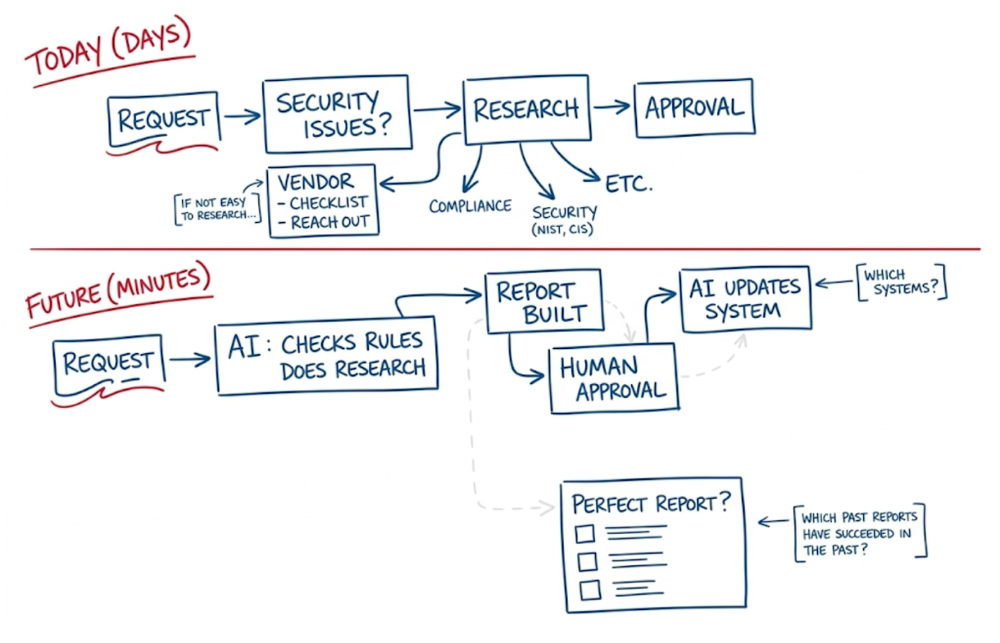
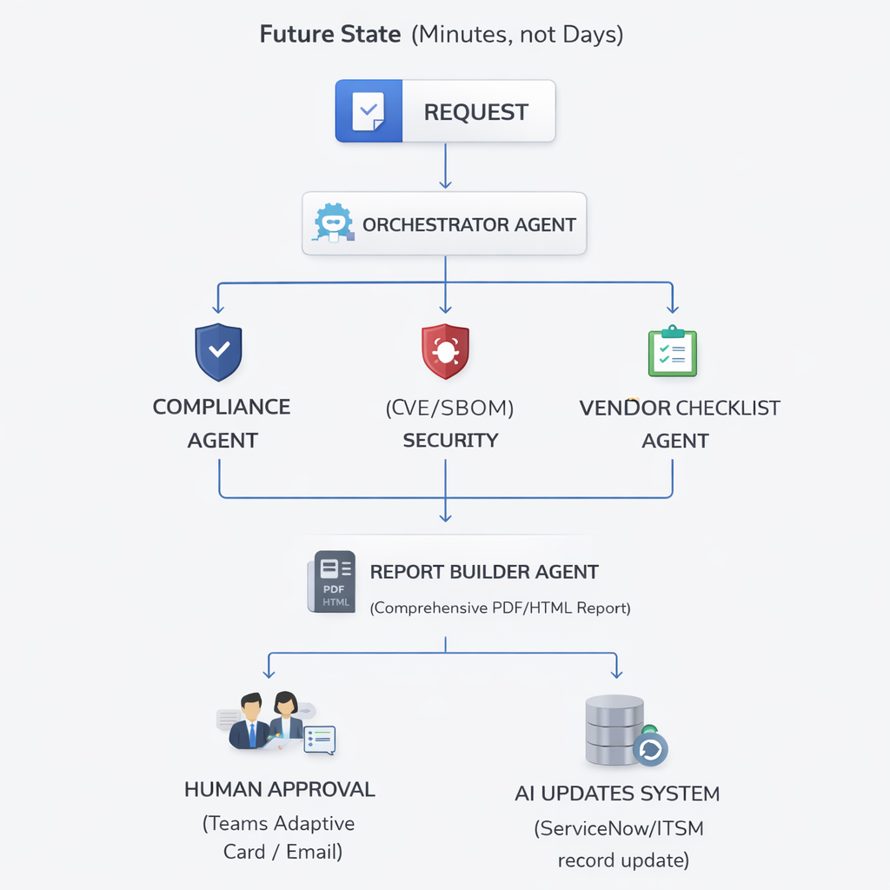
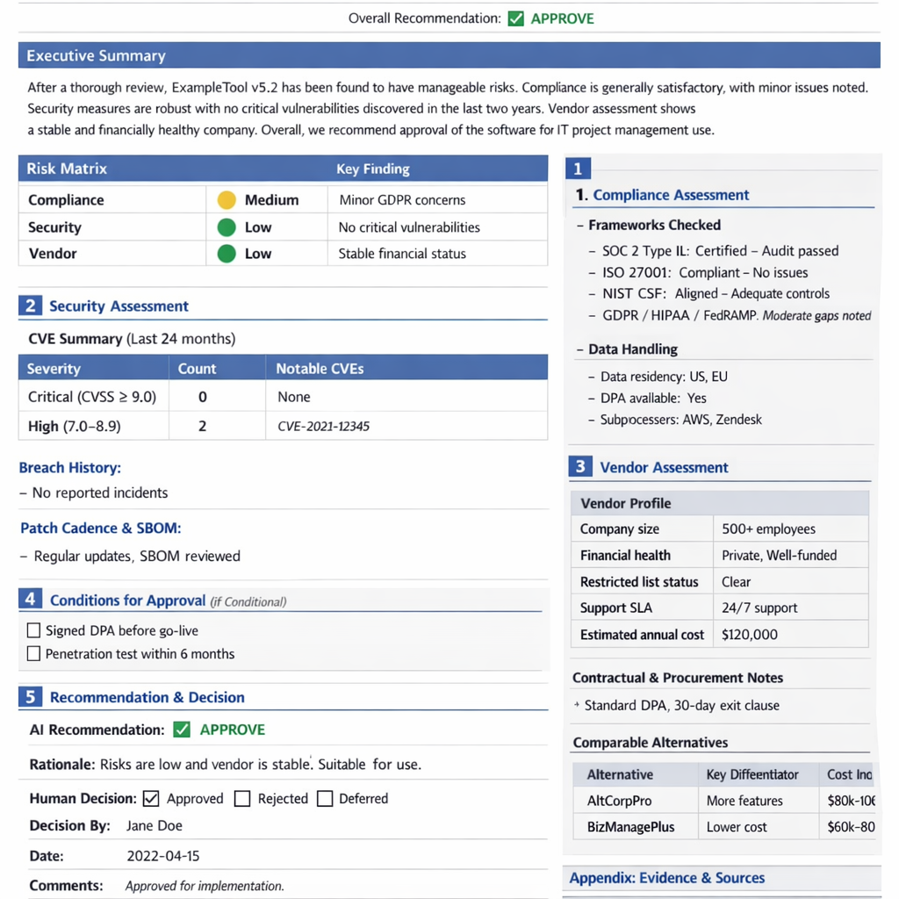
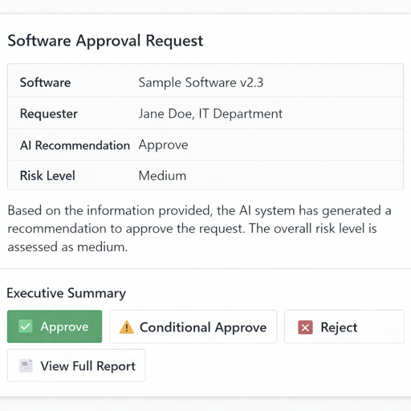
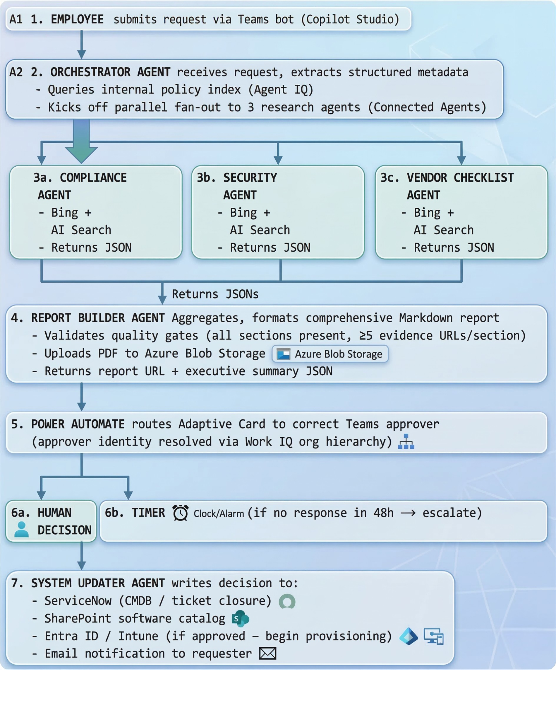

# Software Request Approval — AI-Powered Future Architecture

> **"From Days to Minutes"** — Replace a manual, multi-day software approval workflow with an AI multi-agent system built on **Microsoft Foundry** that researches, evaluates, and reports on software requests automatically, routing only the final decision to a human approver.



---

## Table of Contents

1. [Architecture Overview](#1-architecture-overview)
2. [Multi-Agent Design](#2-multi-agent-design)
   - [Orchestrator Agent](#21-orchestrator-agent)
   - [Compliance Research Agent](#22-compliance-research-agent)
   - [Security Research Agent](#23-security-research-agent)
   - [Vendor Checklist Agent](#24-vendor-checklist-agent)
   - [Report Builder Agent](#25-report-builder-agent)
   - [System Updater Agent](#26-system-updater-agent)
3. [LLM & Web Search Configuration](#3-llm--web-search-configuration)
4. [Report Output Specification](#4-report-output-specification)
5. [Azure Resource Deployment](#5-azure-resource-deployment)
   - [Prerequisites](#51-prerequisites)
   - [Provision the Foundry Project](#52-provision-the-foundry-project)
   - [Deploy Supporting Services](#53-deploy-supporting-services)
   - [Configure Standard Agent Setup](#54-configure-standard-agent-setup)
6. [Foundry Agent Configuration (No-Code)](#6-foundry-agent-configuration-no-code)
   - [Orchestrator Agent Setup](#61-orchestrator-agent-setup)
   - [Research Agent Setup (Compliance, Security, Vendor)](#62-research-agent-setup-compliance-security-vendor)
   - [Report Builder Agent Setup](#63-report-builder-agent-setup)
7. [Microsoft Copilot Studio & Work IQ Integration](#7-microsoft-copilot-studio--work-iq-integration)
8. [Foundry Agent IQ (Knowledge & Grounding)](#8-foundry-agent-iq-knowledge--grounding)
9. [Human Approval Workflow](#9-human-approval-workflow)
10. [Security & RBAC](#10-security--rbac)
11. [Monitoring & Evaluation](#11-monitoring--evaluation)
12. [End-to-End Flow Summary](#12-end-to-end-flow-summary)

---

## 1. Architecture Overview



**Key Platforms Used:**

| Capability | Platform / Service |
|---|---|
| Agent orchestration & hosting | Microsoft Foundry Agent Service |
| LLM reasoning | Azure OpenAI `gpt-4o` (or `o3`) |
| Deep web research | Bing Grounding / Azure AI Search |
| Knowledge & memory | Foundry Agent IQ (Knowledge Store) |
| Workflow & approval | Microsoft Copilot Studio + Work IQ |
| System-of-record updates | Power Automate / Logic Apps |
| Monitoring & evaluation | Azure AI Foundry Evaluation + App Insights |

---

## 2. Multi-Agent Design

The system uses **Microsoft Agent Framework** (part of Azure AI Foundry) in a **fan-out / fan-in** topology. The Orchestrator delegates parallel research tasks to specialist agents and aggregates their outputs into a single structured report.

### 2.1 Orchestrator Agent

**Role:** Entry point. Receives the software request, extracts structured metadata, spawns specialist agents in parallel, waits for outputs, and hands the aggregated findings to the Report Builder Agent.

**Foundry Agent Type:** `prompt` agent backed by `gpt-4o`

**System Prompt excerpt:**
```
You are a Software Request Intake Orchestrator. When you receive a software request, extract:
- Software name, version, vendor, intended use case
- Business justification
- Requester name, department, cost center

Then invoke the following specialist agents in parallel:
- compliance_agent
- security_agent
- vendor_checklist_agent

Collect all outputs, then invoke report_builder_agent with the combined findings.
```

**Tools registered in Foundry portal:**
| Tool | Purpose |
|---|---|
| `invoke_agent` (connected agent) | Fan-out to Compliance, Security, Vendor agents |
| `bing_grounding` | Initial public web lookup of product |
| `azure_ai_search` | Query internal policy knowledge base |

---

### 2.2 Compliance Research Agent

**Role:** Research the software against regulatory and policy frameworks relevant to the organization (SOC 2, ISO 27001, NIST, CIS Controls, GDPR, HIPAA, FedRAMP as applicable).

**Foundry Agent Type:** `prompt` agent backed by `gpt-4o`

**System Prompt excerpt:**
```
You are a Compliance Research Specialist. Your task is to evaluate the requested software against regulatory frameworks.
Research the following for the given software:
1. Does the vendor hold SOC 2 Type II / ISO 27001 certification? Are certifications current?
2. Is the software included in FedRAMP Marketplace (if applicable)?
3. Are there known GDPR, HIPAA, or CCPA compliance gaps?
4. What data residency options are available? Does the vendor offer data processing agreements (DPA)?
5. Review any relevant government or industry watchlists.

Output a structured JSON with: compliant (boolean), frameworks_checked (list), findings (list of {framework, status, notes}), risk_level (Low/Medium/High/Critical), evidence_urls (list).
```

**Tools:**
| Tool | Purpose |
|---|---|
| `bing_grounding` | Web search for compliance certifications, DPA status |
| `azure_ai_search` | Internal compliance policy knowledge base |
| `code_interpreter` | Parse & summarize certification documents |

---

### 2.3 Security Research Agent

**Role:** Assess the software's security posture — CVE history, SBOM, known vulnerabilities, breach history, and alignment with security benchmarks (NIST CSF, CIS Controls).

**Foundry Agent Type:** `prompt` agent backed by `gpt-4o`

**System Prompt excerpt:**
```
You are a Security Research Specialist. Evaluate the requested software for security risks.
Research the following:
1. Search the NVD (nvd.nist.gov) and CVE databases for known vulnerabilities. Report CVSS scores ≥ 7.0.
2. Check HaveIBeenPwned, BreachAware, and public breach databases for vendor incidents.
3. Identify whether the vendor publishes a SBOM or VEX document.
4. Assess patch cadence: how quickly does the vendor release security patches?
5. Check vendor's bug bounty program status.
6. Identify whether the software uses open-source components with high-severity OSS CVEs.

Output structured JSON with: cve_count_critical, cve_count_high, breach_history (list), patch_cadence, sbom_available (boolean), risk_score (0–100), risk_level, evidence_urls.
```

**Tools:**
| Tool | Purpose |
|---|---|
| `bing_grounding` | CVE lookups, breach news, security advisories |
| `azure_ai_search` | Internal security baseline knowledge |
| `code_interpreter` | Score aggregation and risk calculation |

---

### 2.4 Vendor Checklist Agent

**Role:** Gather vendor viability, contractual, and procurement-related facts. Fill out the standard vendor due-diligence checklist automatically.

**Foundry Agent Type:** `prompt` agent backed by `gpt-4o`

**System Prompt excerpt:**
```
You are a Vendor Due Diligence Specialist. Evaluate the software vendor using the standard procurement checklist.
Research and answer the following:
1. Vendor financial health: publicly traded or privately held? Recent funding rounds? Revenue/employee size.
2. Is the vendor on any government denied/restricted vendor lists (e.g., Entity List, OFAC SDN)?
3. Support model: SLA tiers, support hours, dedicated account manager?
4. Pricing model: per-seat, consumption, enterprise agreement? Estimate annual cost for [N] users.
5. Data portability: can the organization export all data if the contract ends?
6. Subprocessors: who are the key subprocessors and where are they located?
7. Alternatives: list 2–3 comparable alternatives with a brief comparison.

Output structured JSON with: vendor_name, vendor_size, financial_health, restricted_list_check (clear/flagged), support_sla, estimated_annual_cost, data_portability, subprocessors (list), alternatives (list), overall_vendor_risk (Low/Medium/High).
```

**Tools:**
| Tool | Purpose |
|---|---|
| `bing_grounding` | Web search for vendor info, news, financials |
| `azure_ai_search` | Internal preferred vendors list |
| `file_search` | Vendor onboarding policy documents |

---

### 2.5 Report Builder Agent

**Role:** Aggregate outputs from all research agents and produce a comprehensive, human-readable approval report (Markdown → rendered to HTML/PDF).

**Foundry Agent Type:** `prompt` agent backed by `gpt-4o`

**System Prompt excerpt:**
```
You are a Report Builder Agent. You receive structured JSON outputs from three research agents and assemble a comprehensive Software Approval Report.
Format the report according to the standard template (see knowledge base: "software-approval-report-template").
The report must include: Executive Summary, Compliance Section, Security Section, Vendor Section, Risk Matrix, Recommendation, and an Appendix with all source URLs.
Set the overall recommendation to: APPROVE / CONDITIONAL APPROVE / REJECT based on aggregated risk.
Output valid Markdown.
```

**Tools:**
| Tool | Purpose |
|---|---|
| `azure_ai_search` | Retrieve report template and past approved reports |
| `code_interpreter` | Render risk matrix table, format JSON → Markdown |

---

### 2.6 System Updater Agent

**Role:** After human decision, update the system of record (ServiceNow, Jira, or SharePoint list) with the final approval status and store the report artifact.

**Foundry Agent Type:** `hosted` agent (uses Power Automate HTTP connector or custom tool)

**Tools:**
| Tool | Purpose |
|---|---|
| `http_connector` (custom) | POST to ServiceNow/ITSM REST API |
| `sharepoint_connector` | Upload report PDF and update list item status |
| `email_connector` | Send approval notification to requester |

---

## 3. LLM & Web Search Configuration

### Model Selection

Configure models in **Microsoft Foundry > Model Catalog > Deployments**:

| Agent | Recommended Model | Rationale |
|---|---|---|
| Orchestrator | `gpt-4o` (2024-11-20) | Fast reasoning, tool calling, low latency |
| Compliance Agent | `gpt-4o` or `o3` | Deep document reasoning |
| Security Agent | `gpt-4o` or `o3` | Long context for CVE reports |
| Vendor Checklist | `gpt-4o` | General research |
| Report Builder | `gpt-4o` | Long-form structured writing |

**Deployment settings (Foundry portal):**

```
Model version:      gpt-4o (2024-11-20)
Deployment name:    gpt-4o-swreq
Tokens per minute:  100,000 (TPM) — scale as needed
Content filtering:  Enabled (default policy)
```

### Grounding with Bing Search (Native Connector)

Microsoft Foundry provides a first-party **Grounding with Bing Search** tool — no separate Azure Bing Search resource provisioning is required. Configure it entirely within the portal:

1. In the [Microsoft Foundry portal](https://ai.azure.com), open your project and navigate to **Knowledge** in the left navigation pane (the Foundry IQ page).
2. Click **Create a knowledge base** (top right).
3. In the **"Choose a knowledge type"** dialog, scroll to the **Tools** section at the bottom.
4. Select **Grounding with Bing Search** — *"Enable your agent to use Grounding with Bing Search to access and return information from the web"*.
5. Click **Connect** — the connection is established automatically with no API key or external resource required.
6. Once connected, the tool appears in your project's tool list and can be added to any agent via the **Agent Builder**.

> **Tip:** Configure each research agent's system prompt to issue multiple targeted queries rather than one broad query (e.g., `"<SoftwareName> SOC 2 certification 2025"` vs. `"<SoftwareName> compliance"`).

### Web Knowledge Base (Deep, Scheduled Research)

For authoritative, periodically refreshed web content (NIST, CIS Controls, vendor documentation sites), use the **Web** knowledge base type in the Foundry IQ portal to build an AI Search-backed index that agents query via the Azure AI Search tool:

1. In your project, navigate to **Knowledge** (left nav) — this opens the **Foundry IQ** page.
2. Click **Create a knowledge base** (top right button).
3. In the **"Choose a knowledge type"** dialog, under **Configure a knowledge base**, select **Web** — *"Ground with real-time web content via Bing"*.
4. Click **Connect**.
5. Enter a name (e.g., `web-security-kb`) and add the URLs to crawl — for example:
   - `https://nvd.nist.gov` (CVE/NVD data)
   - `https://www.cisecurity.org/controls` (CIS Controls)
   - `https://marketplace.fedramp.gov` (FedRAMP authorized products)
6. Select embedding model: `text-embedding-3-large`.
7. Enable **semantic chunking**.
8. Set a **refresh schedule** (weekly recommended for compliance and security sites).
9. Once the knowledge base is active, add it to the relevant research agent via the agent's **Knowledge** tab in Agent Builder.

### Azure AI Search (Internal Knowledge)

Use Azure AI Search as a grounding store for internal policies, past reports, and approved/denied vendor lists.

1. Provision an **Azure AI Search** instance (Standard tier recommended).  
2. Create indexes:
   - `policy-index` — internal IT/security/compliance policies
   - `vendor-index` — approved/denied vendors, past evaluations
   - `report-template-index` — approved report templates and past successful reports
3. Connect in Foundry: navigate to **Knowledge** (left nav) → **Create a knowledge base** → under the **Tools** section in the dialog, select **Azure AI search** and follow the connection flow.
4. Configure semantic ranking:

```json
{
  "tool_type": "azure_ai_search",
  "index_name": "policy-index",
  "query_type": "semantic",
  "semantic_config": "policy-semantic-config",
  "top_k": 5
}
```

### `o3` / Deep Research Mode (Optional Advanced Config)

For higher-stakes approvals, route Compliance and Security agents to `o3` for deeper multi-step reasoning:

- Deploy `o3` in **Foundry > Model Catalog**.
- Set `reasoning_effort: "high"` in the agent system message or API parameters.
- Note: `o3` has higher latency (~minutes per complex query); use for async/background processing.

---

## 4. Report Output Specification

The **Report Builder Agent** produces a structured Markdown document that is converted to HTML/PDF before being routed to the human approver. The report must contain the following sections to be considered **complete**:

---

### 4.1 Report Template

```markdown
# Software Approval Report
**Report ID:** SW-YYYYMMDD-XXXX  
**Generated:** [timestamp]  
**Requested By:** [name, department]  
**Software:** [name] v[version] — [vendor]  
**Use Case:** [description]  
**Overall Recommendation:** ✅ APPROVE | ⚠️ CONDITIONAL APPROVE | ❌ REJECT

---
## Executive Summary
[2–3 paragraph AI-written summary of overall risk and recommendation rationale]

## Risk Matrix
| Category | Risk Level | Key Finding |
|---|---|---|
| Compliance | 🟢 Low / 🟡 Medium / 🔴 High | [finding] |
| Security | 🟢 Low / 🟡 Medium / 🔴 High | [finding] |
| Vendor | 🟢 Low / 🟡 Medium / 🔴 High | [finding] |

## 1. Compliance Assessment
### Frameworks Checked
- SOC 2 Type II: [status] — [notes]
- ISO 27001: [status] — [notes]
- NIST CSF: [status] — [notes]
- GDPR / HIPAA / FedRAMP: [status] — [notes]

### Data Handling
- Data residency: [regions]
- DPA available: [Yes/No/Link]
- Subprocessors: [list]

### Compliance Findings
[Detailed narrative]

## 2. Security Assessment
### CVE Summary (Last 24 months)
| Severity | Count | Notable CVEs |
|---|---|---|
| Critical (CVSS ≥ 9.0) | N | CVE-XXXX-YYYY |
| High (7.0–8.9) | N | — |

### Breach History
[Vendor breach incidents]

### Patch Cadence & SBOM
[Assessment]

### Security Recommendation
[Narrative]

## 3. Vendor Assessment
### Vendor Profile
| Attribute | Value |
|---|---|
| Company size | [employees, revenue] |
| Financial health | [public/private, funding] |
| Restricted list status | Clear / FLAGGED |
| Support SLA | [details] |
| Estimated annual cost | $[N] |

### Contractual & Procurement Notes
[DPA, exit clauses, data portability]

### Comparable Alternatives
| Alternative | Key Differentiator | Cost Indication |
|---|---|---|
| [Alt 1] | [note] | [range] |
| [Alt 2] | [note] | [range] |

## 4. Conditions for Approval (if Conditional)
- [ ] Condition 1: [e.g., Require signed DPA before go-live]
- [ ] Condition 2: [e.g., Penetration test results within 6 months]

## 5. Recommendation & Decision

**AI Recommendation:** [APPROVE / CONDITIONAL APPROVE / REJECT]  
**Rationale:** [detailed justification]

**Human Decision:** [ ] Approved  [ ] Rejected  [ ] Deferred  
**Decision By:** ______________________  
**Date:** ______________________  
**Comments:** ______________________

## Appendix: Evidence & Sources
| Source | URL | Retrieved |
|---|---|---|
| [description] | [url] | [date] |
```



---

### 4.2 Report Quality Gates

Before routing to human approver, the Report Builder Agent must verify:

- [ ] All three research agent outputs received (no timeouts)
- [ ] At least 5 evidence URLs cited per section
- [ ] Risk matrix fully populated
- [ ] Recommendation field set

If any gate fails, flag the report as **INCOMPLETE** and alert the workflow coordinator.

---

## 5. Azure Resource Deployment

### 5.1 Prerequisites

- Azure subscription with **Owner** or **Contributor** + **User Access Administrator** roles
- Azure CLI installed (`az --version` ≥ 2.60)
- Azure Developer CLI installed (`azd --version` ≥ 1.9)
- Bicep CLI (`az bicep install`)
- Azure AI Projects Python SDK (installed via `pip install azure-ai-projects`)

### 5.2 Provision the Foundry Project

**Step 1 — Create a resource group:**
```bash
az group create \
  --name rg-swreq-approval \
  --location eastus2
```

**Step 2 — Create the Microsoft Foundry Project:**

In the [Microsoft Foundry portal](https://ai.azure.com):
1. Click **+ New project**.
2. Set **Project name**: `swreq-approval-project`.
3. Select your subscription and resource group `rg-swreq-approval`.
4. Select region: `East US 2` (recommended for model availability).
5. Under **Customize**, the portal auto-provisions the required backing resources:
   - Azure AI Services (multi-service account)
   - Azure Key Vault
   - Azure Storage Account
6. Click **Create project**.

> The explicit Hub resource is abstracted in the current Microsoft Foundry experience. The **Project** is the primary workspace. A hub is created automatically in the background but you interact exclusively with the project.

**Step 3 — Note the project endpoint:**
```
https://<hub-name>.services.ai.azure.com/api/projects/<project-name>
```

### 5.3 Deploy Supporting Services

**Azure OpenAI Model Deployment:**

In **Foundry > Model Catalog**:
1. Search for `gpt-4o`.
2. Select version `2024-11-20`.
3. Click **Deploy** > **Customize**:
   - Deployment name: `gpt-4o-swreq`
   - Tokens per minute: `100,000`
4. Repeat for `o3` (optional, for deep research agents).

> **Grounding with Bing Search** is a native first-party tool in Microsoft Foundry — no separate Bing resource provisioning is needed. It is enabled directly in the agent's **Tools** panel in the portal (see [Section 3](#3-llm--web-search-configuration)).

**Azure AI Search:**
```bash
az search service create \
  --name ai-search-swreq \
  --resource-group rg-swreq-approval \
  --sku standard \
  --location eastus2 \
  --partition-count 1 \
  --replica-count 1
```

**Azure Storage (for report artifacts):**
```bash
az storage account create \
  --name swreqreports \
  --resource-group rg-swreq-approval \
  --location eastus2 \
  --sku Standard_LRS \
  --kind StorageV2
```

### 5.4 Configure Standard Agent Setup

The **Standard Agent Setup** enables bringing your own Azure Storage and AI Search for agent threads and knowledge.

In the [Foundry portal](https://ai.azure.com):
1. Navigate to your project > **Settings > Agent settings**.
2. Select **Standard setup**.
3. Connect:
   - **Azure AI Storage**: select `swreqreports` storage account.
   - **Azure AI Search**: select `ai-search-swreq`.
4. Click **Apply**.

> This provisions a **Capability Host** that agents use for thread storage, file retrieval, and knowledge indexing.

---

## 6. Foundry Agent Configuration (No-Code)

All agents are configured entirely through the **Microsoft Foundry portal** — no custom code deployment required for the core multi-agent workflow.

### 6.1 Orchestrator Agent Setup

1. In [ai.azure.com](https://ai.azure.com), open your project.
2. Navigate to **Agents > + New agent**.
3. Set:
   - **Name**: `orchestrator-agent`
   - **Model**: `gpt-4o-swreq`
   - **Instructions**: Paste the Orchestrator system prompt from [Section 2.1](#21-orchestrator-agent).
4. Under **Tools**, add:
   - **Bing Grounding** → select your Bing connection
   - **Azure AI Search** → index: `policy-index`
   - **Connected Agents** → add `compliance-agent`, `security-agent`, `vendor-checklist-agent`
5. Click **Save**.

> **Connected Agents** is the Foundry portal feature that enables the fan-out multi-agent pattern without code. Each connected agent appears as a callable tool to the orchestrator.

### 6.2 Research Agent Setup (Compliance, Security, Vendor)

Repeat for each research agent (`compliance-agent`, `security-agent`, `vendor-checklist-agent`):

1. **Agents > + New agent**.
2. Configure name and paste the relevant system prompt from [Section 2](#2-multi-agent-design).
3. **Model**: `gpt-4o-swreq` (or `o3` for compliance/security if deeper reasoning needed).
4. **Tools**:
   - Bing Grounding (all three agents)
   - Azure AI Search → appropriate index per agent
   - Code Interpreter → enable for Security and Compliance agents
5. **Save**.

### 6.3 Report Builder Agent Setup

1. **Agents > + New agent**, name: `report-builder-agent`.
2. **Model**: `gpt-4o-swreq`.
3. **Instructions**: Paste Report Builder system prompt from [Section 2.5](#25-report-builder-agent).
4. **Tools**:
   - Azure AI Search → `report-template-index`
   - Code Interpreter → enabled
   - File Search → enabled (for retrieving template documents)
5. Upload the report template (from [Section 4.1](#41-report-template)) as a **knowledge file** in the agent's **Files** tab.
6. **Save**.

---

## 7. Microsoft Copilot Studio & Work IQ Integration

**Microsoft Copilot Studio** serves as the conversational front-end and workflow coordinator. **Work IQ** (part of Microsoft 365 Copilot) provides work-context awareness (org chart, requester history, budget approval chains).

### 7.1 Submission Channel (Copilot Studio)

1. In [Copilot Studio](https://copilotstudio.microsoft.com), create a new **AI Agent**: `Software Request Bot`.
2. Add a **topic**: "New Software Request".
3. Define an **intake form** collecting:
   - Software name + version
   - Vendor name
   - Business justification
   - Requester details (auto-populated from Entra ID)
   - Number of licenses needed
4. Add an **action**: **Call Azure AI Foundry agent** (use the HTTP connector to trigger the `orchestrator-agent` via the Foundry Agents API).
5. Publish the bot to **Microsoft Teams** for end-user access.

### 7.2 Approval Routing (Work IQ)

Work IQ connects the AI process to organizational approval chains:

1. After the report is generated, use **Power Automate** triggered by the Foundry agent completion to:
   - Route the report to the **correct approver** based on requester's department (resolved via Work IQ's org-hierarchy lookup).
   - Send an **Adaptive Card in Teams** to the approver with: report link, AI recommendation, approve/reject/defer buttons.
2. The approver's decision is captured back into Power Automate, which triggers the **System Updater Agent**.

### 7.3 Copilot Studio + Foundry Connection Setup

1. In Copilot Studio, add a **custom connector** pointing to:
   ```
   POST https://<project-endpoint>/agents/<agent-id>/sessions/<session-id>/messages
   ```
2. Authenticate using **Entra ID (OAuth 2.0)** — no API keys in connectors.
3. Configure the connector action to pass the user's intake form as the message body.

---

## 8. Foundry Agent IQ (Knowledge & Grounding)

**Agent IQ** (the knowledge indexing capability in Foundry) gives agents long-term memory and domain-specific grounding beyond web search.

### 8.1 Knowledge Indexes to Configure

| Index Name | Content | Use By |
|---|---|---|
| `policy-index` | IT security policy, acceptable use policy, procurement policy | All agents |
| `vendor-index` | Approved vendor list, denied vendor list, past evaluations | Orchestrator, Vendor Agent |
| `report-template-index` | Past approved reports, report templates | Report Builder |
| `compliance-frameworks-index` | NIST CSF, CIS Controls, ISO annexes, FedRAMP package docs | Compliance Agent |
| `cve-bulletins-index` | Internal security advisories, patch notes, red team findings | Security Agent |

### 8.2 Populating Knowledge Bases

All knowledge bases are created from the **Foundry IQ** page:

1. In your project, navigate to **Knowledge** in the left navigation pane.
2. Click **Create a knowledge base** (top right).
3. In the **"Choose a knowledge type"** dialog, select the appropriate source under **Configure a knowledge base**:

| Source | When to use | Notes |
|---|---|---|
| **Azure AI Search Index** | Connect an existing AI Search index | Enterprise-scale; use for `policy-index`, `vendor-index` |
| **Azure Blob Storage** | Upload policy PDFs, past reports | Backed by Foundry IQ ingestion pipeline |
| **Web** | Crawl NIST, CIS, FedRAMP, vendor docs | Real-time web via Bing; no re-indexing required |
| **Microsoft SharePoint (Remote)** | Live SharePoint content without indexing | Uses Microsoft 365 governance; content retrieved at query time |
| **Microsoft SharePoint (Indexed)** | SharePoint content indexed into AI Search | Best for custom retrieval pipelines with semantic ranking |
| **Microsoft OneLake** | Unstructured data from Fabric/OneLake | Use for large-scale analytics data sources |

4. Follow the **Connect** flow for the selected source type.
5. Set **refresh schedule** (weekly recommended for compliance and security knowledge bases).
6. Once the knowledge base status shows **Active**, add it to the relevant agent via the agent's **Knowledge** tab in Agent Builder.

### 8.3 Grounding Strategy

- **Compliance Agent**: Query `compliance-frameworks-index` first (internal), then `bing_grounding` for live certification status.
- **Security Agent**: Query `cve-bulletins-index` (internal), then Bing for live NVD data.
- **Vendor Agent**: Query `vendor-index` (internal approved/denied list), then Bing for public vendor info.
- **Report Builder**: Query `report-template-index` only (no live web search needed).

---

## 9. Human Approval Workflow

### 9.1 Teams Adaptive Card

The approver receives a Teams Adaptive Card (sent via Power Automate) that contains an embedded summary and links to the full report:

```json
{
  "type": "AdaptiveCard",
  "version": "1.5",
  "body": [
    { "type": "TextBlock", "text": "Software Approval Request", "size": "Large", "weight": "Bolder" },
    { "type": "FactSet", "facts": [
      { "title": "Software", "value": "${softwareName} v${version}" },
      { "title": "Requester", "value": "${requesterName}, ${department}" },
      { "title": "AI Recommendation", "value": "${recommendation}" },
      { "title": "Risk Level", "value": "${overallRisk}" }
    ]},
    { "type": "TextBlock", "text": "${executiveSummary}", "wrap": true }
  ],
  "actions": [
    { "type": "Action.Submit", "title": "✅ Approve", "data": { "decision": "approve" } },
    { "type": "Action.Submit", "title": "⚠️ Conditional Approve", "data": { "decision": "conditional" } },
    { "type": "Action.Submit", "title": "❌ Reject", "data": { "decision": "reject" } },
    { "type": "Action.OpenUrl", "title": "📄 View Full Report", "url": "${reportUrl}" }
  ]
}
```



### 9.2 Past Reports as Grounding ("Which past reports have succeeded?")

The system learns from history. The Report Builder Agent queries `report-template-index` for:
- Past APPROVED reports for similar software categories → use as positive grounding examples.
- Past REJECTED reports → identify common rejection reasons to flag proactively.

This directly maps to the "Which past reports have succeeded?" annotation in the architecture diagram.

### 9.3 System Identification ("Which systems?")

When the System Updater Agent runs post-approval, it identifies all downstream systems that need updating:
- **ServiceNow** — create CMDB entry / software asset record
- **Microsoft Entra ID** — begin provisioning group/license assignment
- **Microsoft Intune** — flag for app packaging/deployment
- **SharePoint Software Catalog** — add to approved software list

---

## 10. Security & RBAC

### 10.1 Identity Model

All agents authenticate to Azure services using **Managed Identity** — no secrets or API keys in agent configurations.

| Identity | Type | Permissions |
|---|---|---|
| Foundry Agent Service | System-assigned MI | Azure AI Search Data Reader, Storage Blob Data Contributor |
| Copilot Studio Connector | User-delegated | Foundry Agents API caller (custom role) |
| Power Automate Flows | Connection MI | Teams message sender, SharePoint writer |
| System Updater Agent | System-assigned MI | ServiceNow integration (HTTPS only) |

### 10.2 RBAC Configuration

```bash
# Grant Foundry project agents access to Azure AI Search
az role assignment create \
  --assignee <foundry-agent-managed-identity-object-id> \
  --role "Search Index Data Reader" \
  --scope /subscriptions/{sub}/resourceGroups/rg-swreq-approval/providers/Microsoft.Search/searchServices/ai-search-swreq

# Grant access to Storage for report uploads
az role assignment create \
  --assignee <foundry-agent-managed-identity-object-id> \
  --role "Storage Blob Data Contributor" \
  --scope /subscriptions/{sub}/resourceGroups/rg-swreq-approval/providers/Microsoft.Storage/storageAccounts/swreqreports
```

### 10.3 Content Safety

In **Foundry > Content Safety**:
- Enable **Prompt Shield** (jailbreak detection) on all agents — prevents adversarial software submissions designed to bypass security review.
- Set **Content Filtering** to `"Balanced"` profile.
- Enable **Groundedness Detection** on the Report Builder Agent to flag hallucinated evidence URLs.

---

## 11. Monitoring & Evaluation

### 11.1 Application Insights

Foundry automatically integrates with Application Insights. Configure custom dashboards:

1. In **Foundry > Tracing**, link an Application Insights workspace.
2. Monitor:
   - Agent invocation latency per research agent
   - Token consumption per request
   - Tool call success/failure rates
   - End-to-end report generation time

### 11.2 Foundry Evaluation

Use **Foundry Evaluation** to continuously assess report quality:

1. **Create evaluation dataset**: In **Foundry > Evaluation > Datasets**, harvest 20–30 completed reports as ground truth.
2. **Configure evaluators**:
   - **Groundedness** — are report claims supported by cited sources?
   - **Relevance** — is the report relevant to the requested software?
   - **Coherence** — is the report logically structured?
   - **Custom evaluator** — "Report Completeness" (checks all required sections present).
3. Run evaluations weekly or after each model/prompt update.
4. Set **regression alerts**: alert if any evaluator score drops >10% vs. baseline.

### 11.3 Key Metrics to Track

| Metric | Target | Alert Threshold |
|---|---|---|
| End-to-end report time | < 5 minutes | > 15 minutes |
| Report completeness score | > 90% | < 80% |
| Groundedness score | > 85% | < 75% |
| Human approval rate | Track (no target) | N/A |
| Bing tool call success rate | > 98% | < 95% |

---

## 12. End-to-End Flow Summary



**Total elapsed time: ~3–7 minutes** (vs. multiple days manually)

---

## References

- [Azure AI Foundry documentation](https://learn.microsoft.com/azure/ai-foundry/)
- [Foundry Agent Service overview](https://learn.microsoft.com/azure/ai-foundry/agents/)
- [Connected Agents (multi-agent)](https://learn.microsoft.com/azure/ai-foundry/agents/how-to/connected-agents)
- [Bing Grounding in Foundry](https://learn.microsoft.com/azure/ai-foundry/agents/how-to/tools/bing-grounding)
- [Azure AI Search integration](https://learn.microsoft.com/azure/ai-foundry/agents/how-to/tools/azure-ai-search)
- [Standard Agent Setup](https://learn.microsoft.com/azure/ai-foundry/agents/how-to/standard-agent-setup)
- [Microsoft Copilot Studio](https://learn.microsoft.com/microsoft-copilot-studio/)
- [Work IQ overview](https://learn.microsoft.com/microsoft-365-copilot/work-iq)
- [Foundry Evaluation](https://learn.microsoft.com/azure/ai-foundry/how-to/evaluate-generative-ai-app)
- [Foundry Samples GitHub](https://github.com/azure-ai-foundry/foundry-samples)
